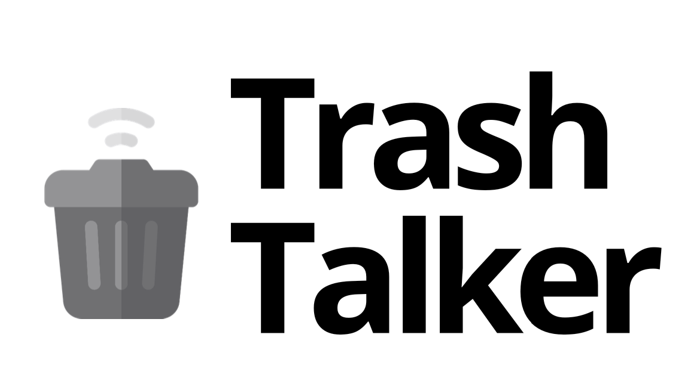

:articulated_lorry: Monitoring system for waste collection points :articulated_lorry:

## **Description**

This project aims to develop an application that is able to manage and monitor garbage container a waste company, for this purpose sensors with `arduino` will be used to control the flow inside the waste bin, recording in real time the percentage of occupancy. An `Android` mobile application for the worker to register the collection of a garbage container. Thus facilitating decision-making in the management of the company.

## Docs

[Software Requirement Specification](https://github.com/micaellobo/trashTalker/blob/master/Documentacao/SRS.pdf)

[Software Configuration Management Plan](https://github.com/micaellobo/trashTalker/blob/master/Documentacao/SCM_PLAN.md)

[Diagramas](https://github.com/micaellobo/trashTalker/tree/master/Documentacao/Diagramas)

[Mockups](https://github.com/micaellobo/trashTalker/tree/master/Documentacao/Mockups)

## **Technologies**

* **Angular** - Web application to manage all the business logic
* **Android** - Mobile application for the worker to register the collection of a garbage container
* **.NET** - For the development of the Web API
* **SQL** - Relational database for the data persistance
* **Arduino IOT Cloud** - Cloud IoT service used to communicate with sensors

## **Team**

* João Lopes
* Tiago Leite
* João Bragança
* Micael Sampaio
* Flávio Costa

## **Project Arquitecture**

